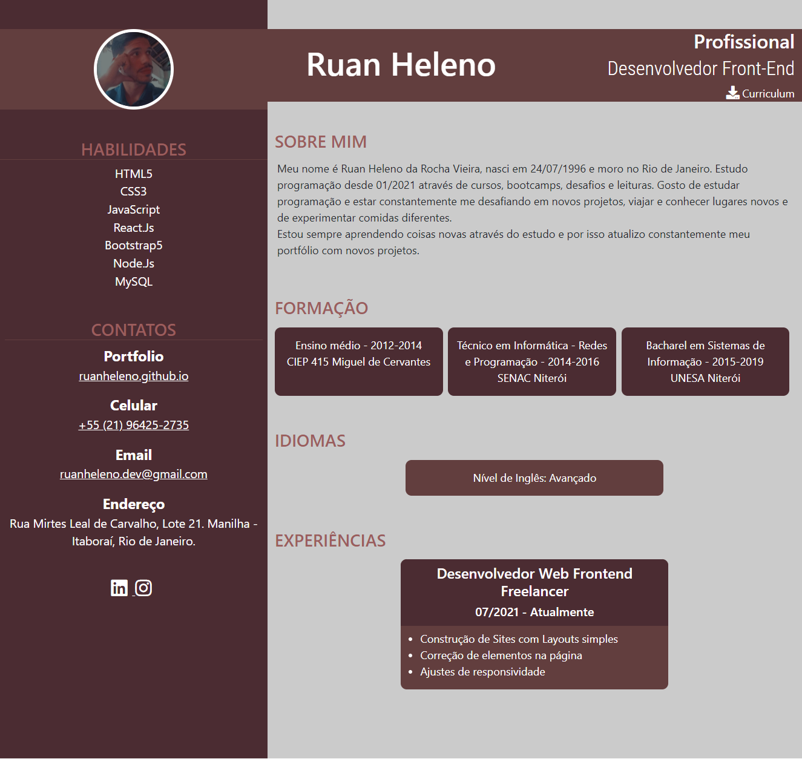

# CURRICULUM VITAE

This is my project [Curriculum Vitae](https://curriculumvitaeruanheleno.netlify.app)

## Table of contents

- [Overview](#overview)
  - [The project](#the-project)
  - [Screenshot](#screenshot)
- [Process](#Process)
  - [Built with](#built-with)
- [Author](#author)

## Overview

### The project

- Create a Curriculum with HTML5, CSS3 and Grids

### Screenshot

## Process

### Built with

- Semantic HTML5 markup
- CSS3
- [Bootstrap5](https://getbootstrap.com)

## Author

- [Portfolio](https://ruanheleno.github.io)
- [LinkedIn](https://www.linkedin.com/in/ruanheleno/)